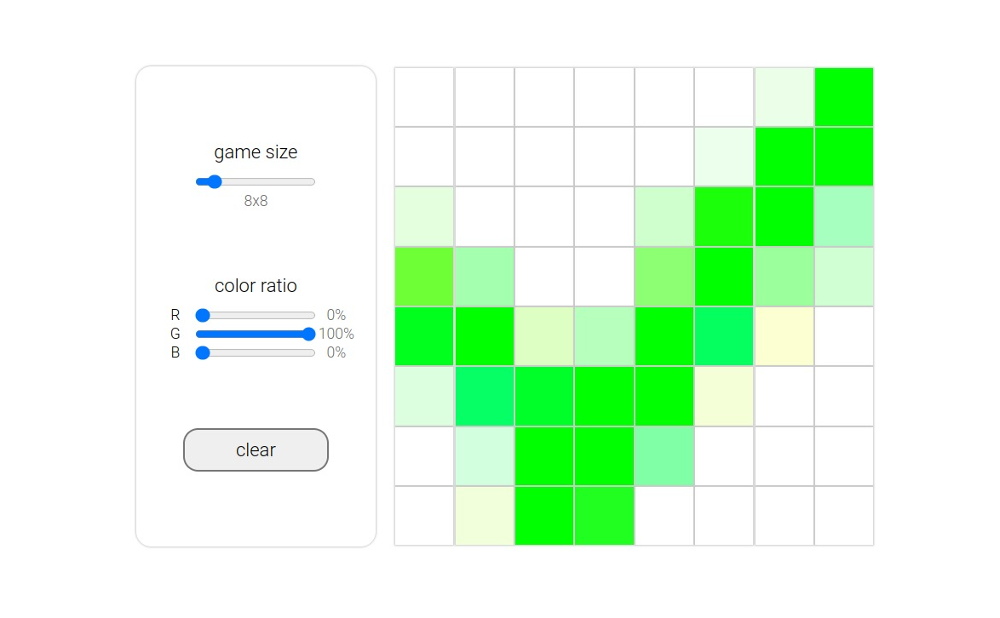
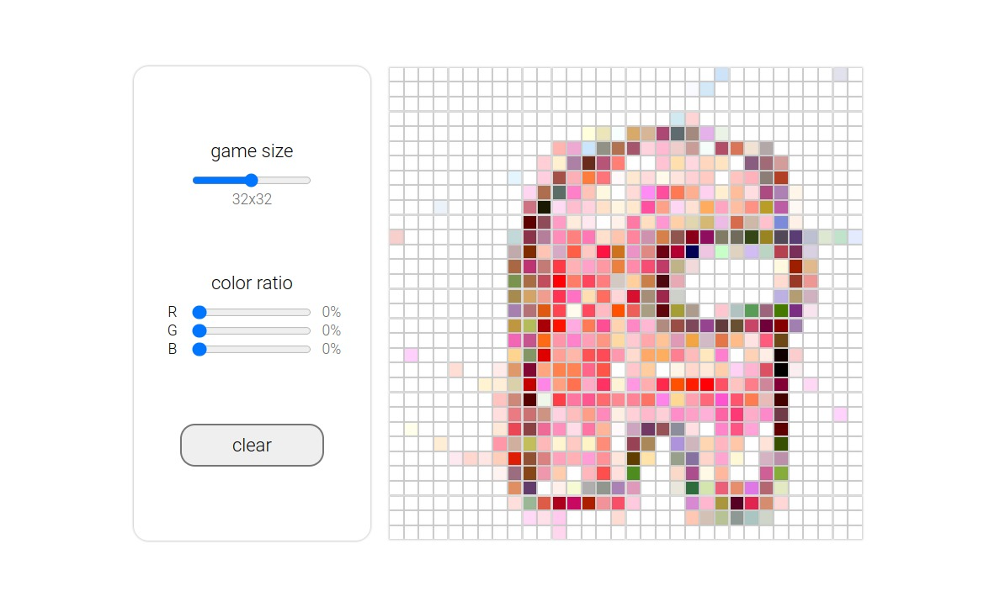

 

<h1 align="center">Etch-A-Sketch Project</h1>

  

    Simple Etch-A-Sketch web-app made
     
    following The Odin project
     
    <a href="https://larrys-code.github.io/Etch-A-Sketch/"><strong>See It Live »</strong></a>
     
     
    <a href="https://www.theodinproject.com/lessons/foundations-etch-a-sketch">See the lesson on The Odin Project</a>
  

<!-- TABLE OF CONTENTS -->

  
Table of Contents

  <ol>
    <li>
      <a href="#about-the-project">About The Project</a>
      <ul>
        <li><a href="#built-with">Built With</a></li>
      </ul>
    </li>
    <li><a href="#features">Features</a></li>
    <li><a href="#preview">Preview</a></li>
    <li><a href="#development-and-future-optimizations">Development and Future Optimizations</a></li>
    <li><a href="#acknowledgments">Acknowledgments</a></li>
  </ol>

<!-- ABOUT THE PROJECT -->
## About The Project

[![Product Name Screen Shot][product-screenshot]](https://larrys-code.github.io/Etch-A-Sketch/)

A simple Etch-A-Sketch built whilst following [The Odin Project][odin-url]. This project was set to practice generating DOM elements in JavaScript and setting Event Listeners to create a basic user interface.

### Built With

#### Languages
* [![CSS][CSS-logo]][CSS-url]
* [![HTML5][HTML5-logo]][HTML5-url]
* [![Javascript][Javascript-logo]][Javascript-url]

(<a href="#readme-top">back to top</a>)

<!-- FEATURES -->
## Features

The user is given some basic options to configure the canvas, and the canvas reacts to the user's mouse movements: gradually adding color to the passed-over square in accordance to the settings.

## Preview

| 8x8 Mode | 32x32 Mode |
| :-----: | :-----: |
|  |  |

(<a href="#readme-top">back to top</a>)

<!-- OPTIMIZATIONS -->
## Development and Future Optimizations

- :green_circle: Variable Canvas size
- :large_orange_diamond: Variable Color modes
    - :green_circle: Color ratio sliders
    - :x: Greyscale mode

See the [open issues](https://github.com/Larrys-code/Etch-A-Sketch/issues) for a full list of proposed features (and known issues).

<!-- ACKNOWLEDGMENTS -->
## Acknowledgments

* This project was completed as a part of [*"The Odin Project"*.](odin-url)

(<a href="#readme-top">back to top</a>)

<!-- MARKDOWN LINKS & IMAGES -->
[product-screenshot]: ./screenshot.png
[odin-url]: https://www.theodinproject.com/lessons/foundations-etch-a-sketch

<!-- APPLICATIONS -->

[CSS-logo]: https://img.shields.io/badge/CSS%20-%231572B6.svg?style=for-the-badge&logo=css3&logoColor=white
[CSS-url]: https://www.w3.org/Style/CSS/#specs

[HTML5-logo]: https://img.shields.io/badge/HTML5%20-%23E34F26.svg?style=for-the-badge&logo=html5&logoColor=white
[HTML5-url]: https://html.spec.whatwg.org/

[Javascript-logo]: https://img.shields.io/static/v1?style=for-the-badge&message=JavaScript&color=222222&logo=JavaScript&logoColor=F7DF1E&label=
[Javascript-url]: https://www.ecma-international.org/publications-and-standards/standards/ecma-262/
